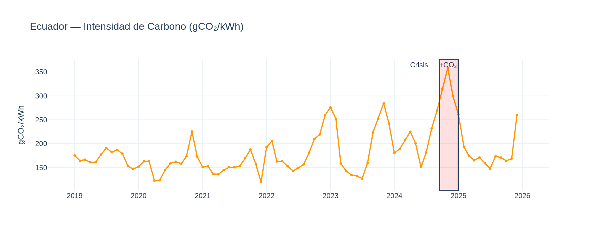

# ⚡ Ecuador Energy Anomalies

> Multi-technique anomaly detection in Latin America's electricity sector. Isolation Forest + STL Decomposition + CUSUM, validated against Ecuador's 2024 energy crisis. 8 countries, 784 months of real data.

[](docs/README_ES.md) [](https://python.org) [](LICENSE)

---

## Why This Project?

Ecuador generates ~70% of its electricity from **hydropower**. Droughts cause blackouts of up to 14 hours. This project detects energy crises automatically using 3 complementary techniques and explains **why** each anomaly was flagged.

### Key Results


| Metric | IF per country | STL | CUSUM | **Consensus ≥2** |
|--------|---------------|-----|-------|-----------------|
| Precision | 50.0% | 28.6% | 18.8% | **60.0%** |
| Recall | 100% | 66.7% | 100% | **100%** |
| F1-Score | 66.7% | 40.0% | 31.6% | **75.0%** |
| MCC | 0.694 | 0.407 | 0.397 | **0.765** |

> Metrics reproduced from `data/processed/metrics.json` via `python scripts/train_model.py`

---

## Data: 8 Countries, 784 Months

| Country | Months | Hydro % | Source |
|---------|--------|---------|--------|
| Ecuador | 85 | 38.1% | Ember |
| Colombia | 120 | 41.1% | Ember |
| Brazil | 99 | 47.9% | Ember |
| Peru | 86 | 28.4% | Ember |
| Chile | 123 | 14.3% | Ember |
| Argentina | 98 | 13.6% | Ember |
| Bolivia | 86 | 14.4% | Ember |
| Uruguay | 87 | 21.0% | Ember |


---

## 3-Technique Approach

Instead of relying on a single model, we use **3 complementary techniques** and require consensus:


| Technique | What it detects | Ecuador crisis oct-dic 2024 |
|-----------|----------------|---------------------------|
| **Isolation Forest** | Multivariate outliers in feature space | 3/3 detected |
| **STL Decomposition** | Residuals beyond 2σ after removing trend+seasonality | 2/3 detected |
| **CUSUM** | Structural change points in hydro generation | 3/3 detected |
| **Consensus ≥2** | Confirmed by at least 2 methods | **3/3 detected** |


---

## Ecuador Energy Mix




---

## Cross-Country Analysis


---

## Confusion Matrix (Consensus, Ecuador)


---

## Statistical Validation

| Variable | p-value | Cohen's d | Effect |
|----------|---------|-----------|--------|
| gen_hydro | 0.002** | 1.29 | LARGE |
| gen_fossil | 0.003** | 1.30 | LARGE |
| co2_intensity | 0.008** | 1.22 | LARGE |

All metrics are **reproducible**: `python scripts/train_model.py` generates `data/processed/metrics.json`.

---

## EDA Notebooks

| # | Notebook | Description |
|---|----------|-------------|
| 00 | [Data Origin & Dictionary](notebooks/EDA/00_origen_y_diccionario_datos.ipynb) | Sources, 20 variables documented |
| 01 | [Loading & Exploration](notebooks/EDA/01_carga_y_exploracion.ipynb) | Structure, first visualizations |
| 02 | [Cleaning & Quality](notebooks/EDA/02_limpieza_y_calidad.ipynb) | Nulls, outliers, consistency |
| 03 | [Pattern Analysis](notebooks/EDA/03_analisis_patrones.ipynb) | Trends, seasonality, correlations |
| 04 | [Feature Engineering](notebooks/EDA/04_feature_engineering.ipynb) | 24 → 213 features |
| 05 | [Model Selection](notebooks/EDA/05_seleccion_modelo.ipynb) | IF vs LOF vs SVM |
| 06 | [Training & Evaluation](notebooks/EDA/06_entrenamiento_evaluacion.ipynb) | Final model, SHAP |
| 07 | [Hyperparameter Tuning](notebooks/EDA/07_tuning_hiperparametros.ipynb) | Optuna, TimeSeriesSplit |
| 08 | [Validation & Metrics](notebooks/EDA/08_validacion_metricas.ipynb) | Statistical tests, bootstrap |

---

## Tech Stack

| Layer | Technology |
|-------|-----------|
| Data | Ember, OWID, World Bank (real monthly data) |
| Processing | pandas, numpy, scipy, statsmodels |
| Anomaly Detection | scikit-learn (Isolation Forest), STL, CUSUM |
| Tuning | optuna |
| Explainability | shap |
| Visualization | plotly |
| Dashboard | streamlit |
| CI/CD | GitHub Actions |

---

## Quick Start

```bash
git clone https://github.com/DiegoFernandoLojanTenesaca/ecuador-energy-anomalies.git
cd ecuador-energy-anomalies
python3 -m venv .venv && source .venv/bin/activate
pip install -r requirements.txt
python scripts/scrape_all.py
python scripts/train_model.py
streamlit run app/app.py
```

---

## Limitations (Honest)

- Monthly granularity misses gradual crises (2023 drought: only 2/4 detected by STL)
- Programmed blackouts (Apr-Jun 2024) don't change generation volumes → undetectable
- 85 real months for Ecuador is the minimum viable for this analysis
- Clustering metrics (Silhouette=0.23) reflect the small sample size, not model failure

## References

- Liu et al. (2008). *Isolation Forest*. IEEE ICDM.
- Cleveland et al. (1990). *STL: A Seasonal-Trend Decomposition*. J. Official Statistics.
- Page (1954). *Continuous Inspection Schemes*. Biometrika (CUSUM).
- Chandola et al. (2009). *Anomaly Detection: A Survey*. ACM Computing Surveys.

---

**Diego Fernando Lojan Tenesaca** — Data & AI Engineer
[](https://github.com/DiegoFernandoLojanTenesaca) [](https://linkedin.com/in/diego-fernando-lojan)