# ⚡ Ecuador Energy Anomalies

> Multi-technique anomaly detection in Latin America's electricity sector. Isolation Forest + STL Decomposition + CUSUM, validated against Ecuador's 2024 energy crisis. 8 countries, 784 months of real data.

[](docs/README_ES.md) [](https://python.org) [](LICENSE)

---

## Why This Project?

Ecuador generates ~70% of its electricity from **hydropower**. Droughts cause blackouts of up to 14 hours. This project detects energy crises automatically using 3 complementary techniques and explains **why** each anomaly was flagged.

### Key Results

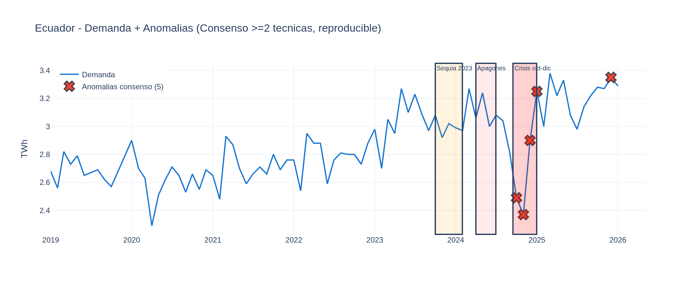

**Ground Truth: Strict (oct-dec 2024, 3 months — peak crisis)**

| Metric | IF | STL | CUSUM | **Consensus** | Weighted |
|--------|-----|-----|-------|-------------|----------|
| Precision | 50.0% | 28.6% | 18.8% | **60.0%** | 60.0% |
| Recall | 100% | 66.7% | 100% | **100%** | 100% |
| F1-Score | 0.667 | 0.400 | 0.316 | **0.750** | 0.750 |
| MCC | 0.694 | 0.407 | 0.397 | **0.765** | 0.765 |

**Ground Truth: Broad (apr-dec 2024, 9 months — Executive Decree 229)**

| Metric | IF | STL | CUSUM | **Consensus** | Weighted |
|--------|-----|-----|-------|-------------|----------|
| Precision | 50.0% | 42.9% | 18.8% | **60.0%** | 60.0% |
| Recall | 33.3% | 33.3% | 33.3% | 33.3% | 33.3% |
| F1-Score | 0.400 | 0.375 | 0.240 | **0.429** | 0.429 |
| MCC | 0.353 | 0.314 | 0.128 | **0.401** | 0.401 |

> All metrics from `data/processed/metrics.json`. Reproduce: `python scripts/train_model.py`
>
> Ecuador crisis officially declared via [Executive Decree No. 229](https://www.cenace.gob.ec/) (Apr 19, 2024) and [CENACE Annual Report 2024](https://www.cenace.gob.ec/wp-content/uploads/downloads/2025/04/Informe-Anual-CENACE-2024-vf-1-88_c.pdf).

---

## Data: 8 Countries, 784 Months

| Country | Months | Hydro % | Source |
|---------|--------|---------|--------|
| Ecuador | 85 | 38.1% | Ember |
| Colombia | 120 | 41.1% | Ember |
| Brazil | 99 | 47.9% | Ember |
| Peru | 86 | 28.4% | Ember |
| Chile | 123 | 14.3% | Ember |
| Argentina | 98 | 13.6% | Ember |
| Bolivia | 86 | 14.4% | Ember |
| Uruguay | 87 | 21.0% | Ember |

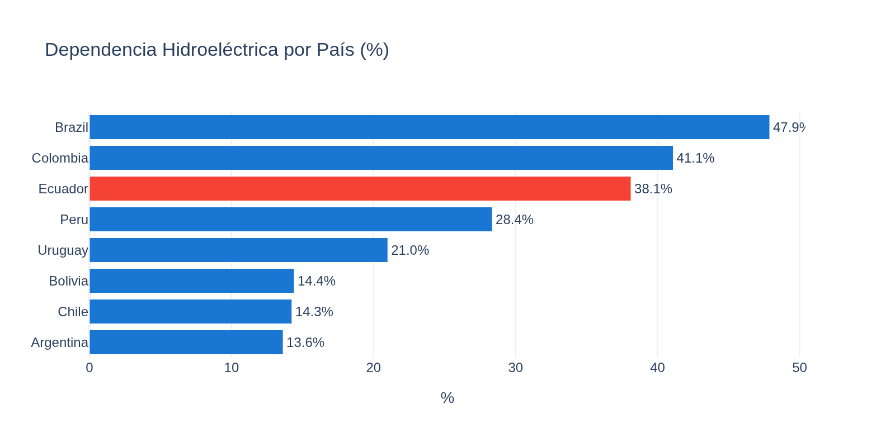

---

## 3-Technique Approach

Instead of relying on a single model, we use **3 complementary techniques** and require consensus:

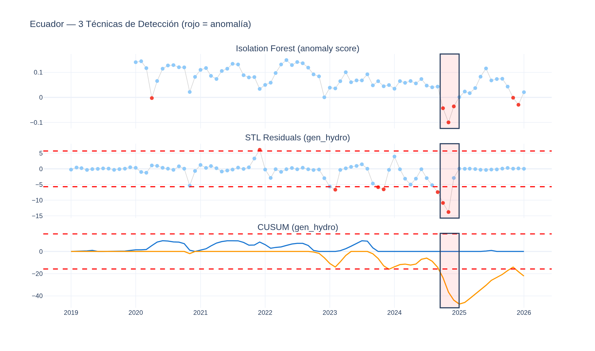

| Technique | What it detects | Ecuador crisis oct-dic 2024 |
|-----------|----------------|---------------------------|
| **Isolation Forest** | Multivariate outliers in feature space | 3/3 detected |
| **STL Decomposition** | Residuals beyond 2σ after removing trend+seasonality | 2/3 detected |
| **CUSUM** | Structural change points in hydro generation | 3/3 detected |
| **Consensus ≥2** | Confirmed by at least 2 methods | **3/3 detected** |

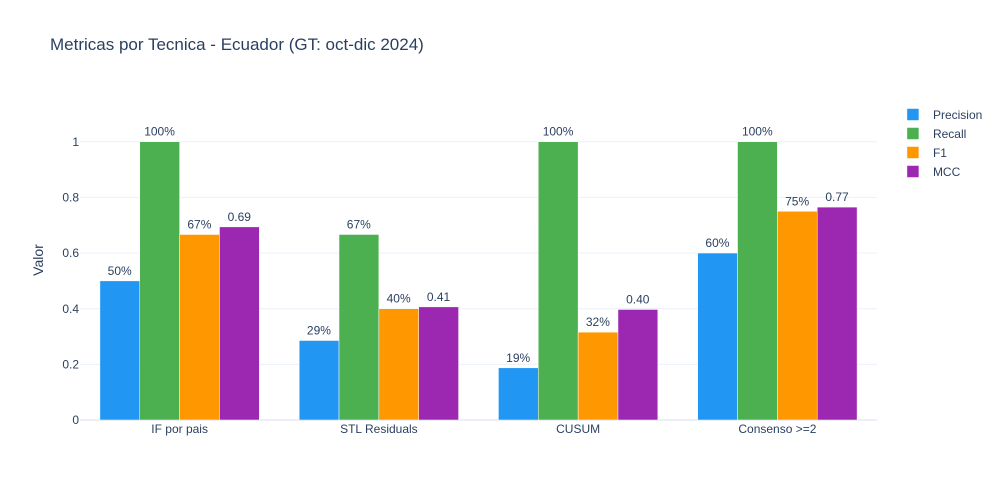

---

## Baseline Comparison (9 Models)

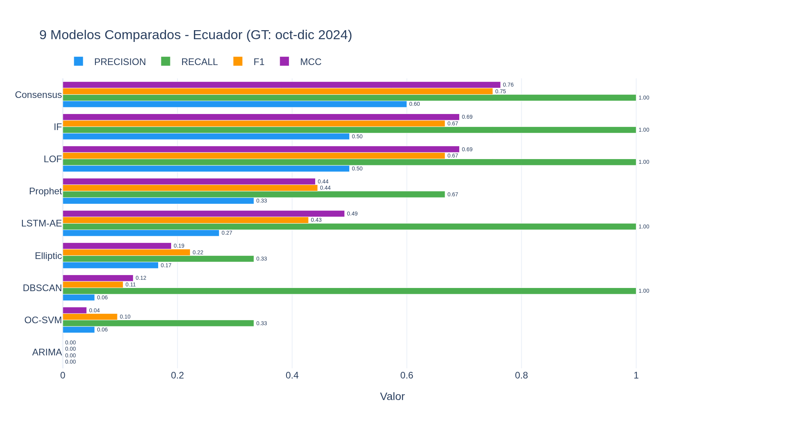

| Model | Precision | Recall | F1 | MCC |
|-------|-----------|--------|-----|-----|
| **Consensus ≥2** | **0.600** | **1.000** | **0.750** | **0.763** |
| IF per country | 0.500 | 1.000 | 0.667 | 0.692 |
| LOF | 0.500 | 1.000 | 0.667 | 0.692 |
| LSTM-AE | 0.273 | 1.000 | 0.429 | 0.491 |
| Prophet | 0.333 | 0.667 | 0.444 | 0.441 |
| Elliptic Envelope | 0.167 | 0.333 | 0.222 | 0.189 |
| DBSCAN | 0.056 | 1.000 | 0.105 | 0.123 |
| One-Class SVM | 0.056 | 0.333 | 0.095 | 0.042 |
| ARIMA | 0.000 | 0.000 | 0.000 | 0.000 |

> Reproducible: `python scripts/run_full_comparison.py` → `data/processed/baselines_comparison.json`

---

## Key Finding: Hydro Dependency Determines Effectiveness

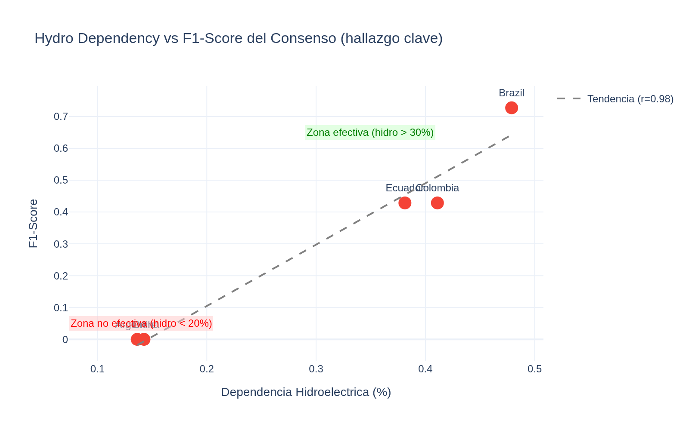

The consensus approach works best in **hydro-dependent countries** (>30% hydro). In fossil-dominant countries, energy crises have different signatures (fuel prices, heatwaves) not captured by hydro-focused STL/CUSUM.

| Country | Hydro % | F1 (Consensus) | Crisis Type |
|---------|---------|---------------|-------------|
| Brazil | 47.9% | **0.727** | Drought (hydro) |
| Colombia | 41.1% | 0.429 | El Nino (hydro) |
| Ecuador | 38.1% | **0.750** | Drought (hydro) |
| Uruguay | 21.0% | — | No documented crisis |
| Chile | 14.3% | 0.000 | Mega-drought (not electrical) |
| Argentina | 13.6% | 0.000 | Heatwave (thermal) |

---

## Confidence Intervals (Bootstrap 95%)

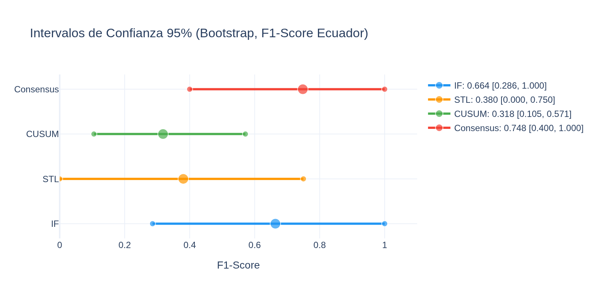

McNemar test (Consensus vs IF): p=1.000 — not statistically significant with n=73. The CI overlap confirms this is a limitation of the sample size, not the method.

---

## Cross-Country Validation

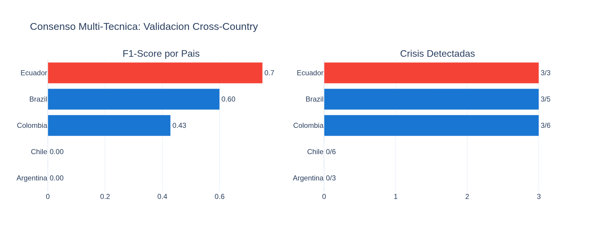

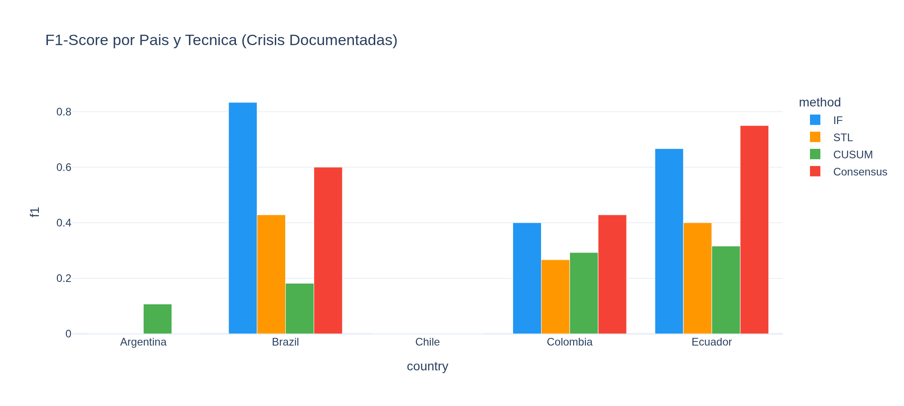

---

## Sensitivity Analysis

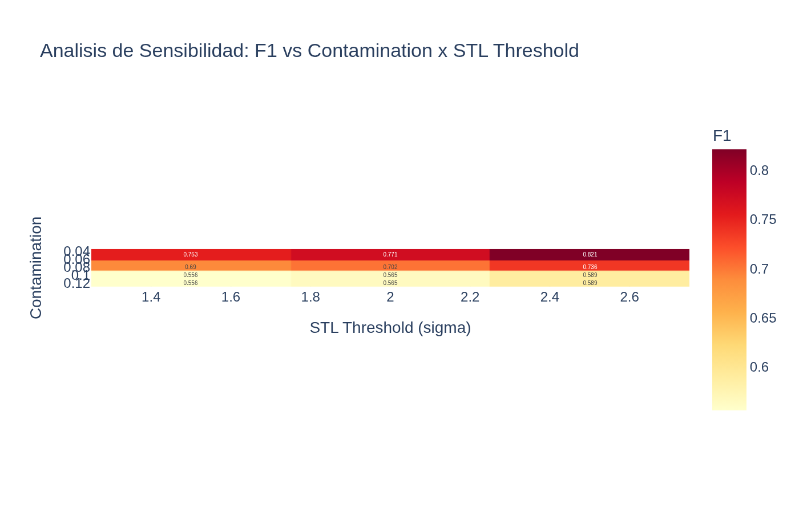

Best config found: `contamination=0.05, stl_sigma=1.5, cusum_factor=4.0` → F1=0.857, MCC=0.861

---

## Ecuador Energy Mix

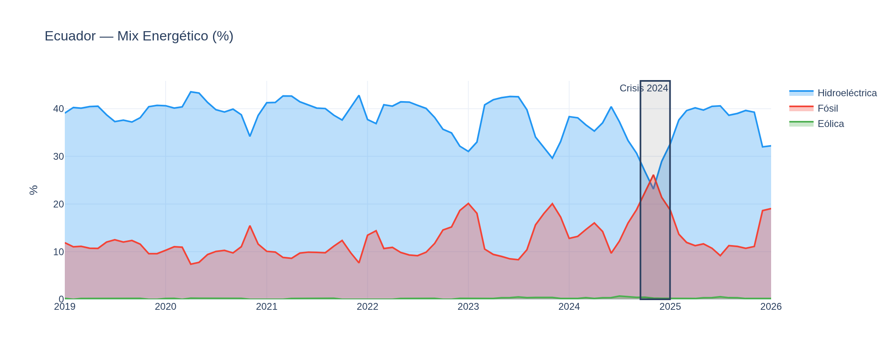

---

## Anomalies by Country

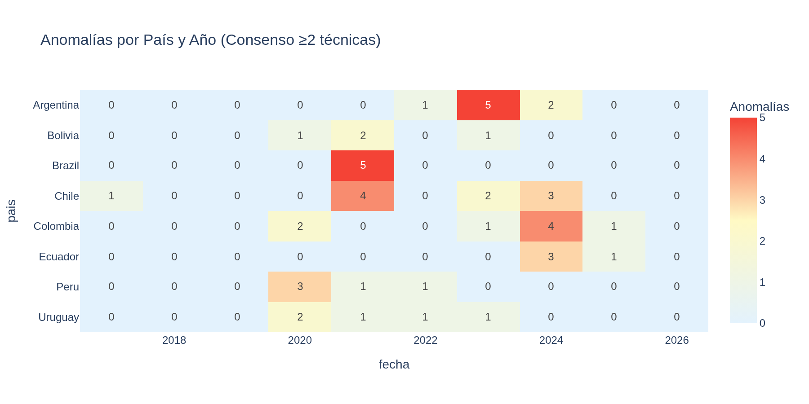

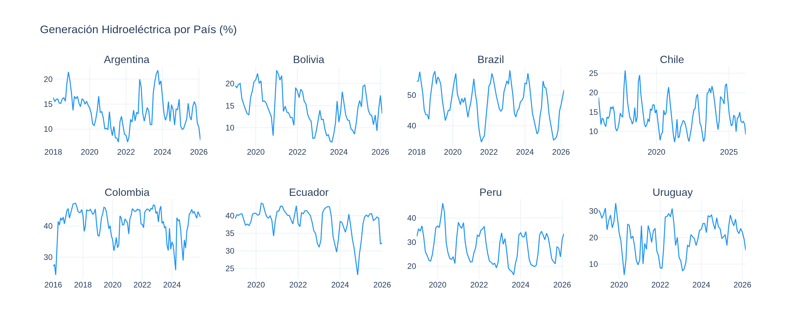

---

## Confusion Matrix (Consensus, Ecuador)

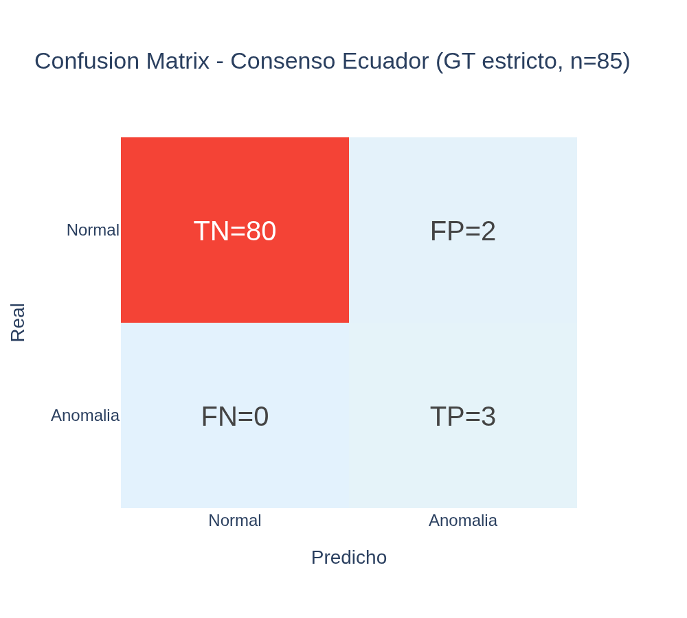

---

## Statistical Validation

| Variable | Normal μ | Anomaly μ | p-value | Cohen's d | Effect |
|----------|----------|-----------|---------|-----------|--------|
| gen_hydro | 38.71% | 28.72% | 0.0004*** | 2.81 | LARGE |
| gen_fossil | 11.87% | 21.47% | 0.0004*** | 3.14 | LARGE |
| co2_intensity | 175.7 | 298.5 | 0.0003*** | 3.15 | LARGE |
| importaciones | 0.04 | 0.16 | 0.0045** | 1.37 | LARGE |
| demanda_twh | 2.86 | 2.87 | 0.9702 ns | 0.04 | SMALL |

> Cohen's d > 2.0 indicates **very large** effect sizes. Anomalous months have dramatically different hydro/fossil profiles.
> Demand shows no significant difference — crises affect the generation mix, not total demand.

---

## EDA Notebooks

| # | Notebook | Description |
|---|----------|-------------|
| 00 | [Data Origin & Dictionary](notebooks/EDA/00_origen_y_diccionario_datos.ipynb) | Sources, 20 variables documented |
| 01 | [Loading & Exploration](notebooks/EDA/01_carga_y_exploracion.ipynb) | Structure, first visualizations |
| 02 | [Cleaning & Quality](notebooks/EDA/02_limpieza_y_calidad.ipynb) | Nulls, outliers, consistency |
| 03 | [Pattern Analysis](notebooks/EDA/03_analisis_patrones.ipynb) | Trends, seasonality, correlations |
| 04 | [Feature Engineering](notebooks/EDA/04_feature_engineering.ipynb) | 24 → 213 features |
| 05 | [Model Selection](notebooks/EDA/05_seleccion_modelo.ipynb) | IF vs LOF vs SVM |
| 06 | [Training & Evaluation](notebooks/EDA/06_entrenamiento_evaluacion.ipynb) | Final model, SHAP |
| 07 | [Hyperparameter Tuning](notebooks/EDA/07_tuning_hiperparametros.ipynb) | Optuna, TimeSeriesSplit |
| 08 | [Validation & Metrics](notebooks/EDA/08_validacion_metricas.ipynb) | Statistical tests, bootstrap |

---

## Tech Stack

| Layer | Technology |
|-------|-----------|
| Data | Ember, OWID, World Bank (real monthly data) |
| Processing | pandas, numpy, scipy, statsmodels |
| Anomaly Detection | scikit-learn (Isolation Forest), STL, CUSUM |
| Tuning | optuna |
| Explainability | shap |
| Visualization | plotly |
| Dashboard | streamlit |
| CI/CD | GitHub Actions |

---

## Quick Start

```bash
git clone https://github.com/DiegoFernandoLojanTenesaca/ecuador-energy-anomalies.git
cd ecuador-energy-anomalies
python3 -m venv .venv && source .venv/bin/activate
pip install -r requirements.txt
python scripts/scrape_all.py
python scripts/train_model.py
streamlit run app/app.py
```

---

## Limitations (Honest)

- **McNemar p=1.0**: Cannot statistically prove consensus > IF with n=73. Difference exists (F1: 0.750 vs 0.667) but insufficient power.
- **Wide bootstrap CI**: Consensus F1=[0.400, 1.000] reflects small sample, not model failure.
- **Fails in low-hydro countries**: Chile (F1=0.0) and Argentina (F1=0.0) have non-hydro crises undetectable by STL/CUSUM.
- **Monthly granularity**: Programmed blackouts (Apr-Jun 2024) don't change generation volumes.
- **Broad GT recall=33%**: With 9-month decree as GT, model only detects 3 peak months (the most severe).
- **85 months Ecuador**: Minimum viable. More data would narrow CIs and increase statistical power.

## Official Sources (Ground Truth)

| Country | Crisis | Official Source |
|---------|--------|----------------|
| Ecuador | Apr-Dec 2024 | Executive Decree No. 229; CENACE Annual Report 2024 |
| Brazil | Jun-Nov 2021 | Decree 10.939/2021; MP 1.055/2021 (CREG) |
| Colombia | Jan-Jun 2024 | XM Colombia market reports; +22.68% wholesale prices |
| Chile | 2019 (acute) | U. de Chile; Biblioteca del Congreso Nacional |
| Argentina | Jan-Mar 2022 | SMN Argentina; FARN climate report |

## References

- Liu, F.T., Ting, K.M., Zhou, Z.H. (2008). *Isolation Forest*. IEEE ICDM.
- Cleveland, R.B. et al. (1990). *STL: A Seasonal-Trend Decomposition*. J. Official Statistics.
- Page, E.S. (1954). *Continuous Inspection Schemes*. Biometrika.
- Chandola, V. et al. (2009). *Anomaly Detection: A Survey*. ACM Computing Surveys.
- Himeur, Y. et al. (2021). *AI-based anomaly detection of energy consumption*. Applied Energy.
- Akiba, T. et al. (2019). *Optuna*. ACM SIGKDD.
- CENACE (2025). *Informe Anual 2024*. cenace.gob.ec.
- Ember (2026). *Global Electricity Data*. ember-energy.org.

---

**Diego Fernando Lojan Tenesaca** — Data & AI Engineer
[](https://github.com/DiegoFernandoLojanTenesaca) [](https://linkedin.com/in/diego-fernando-lojan)