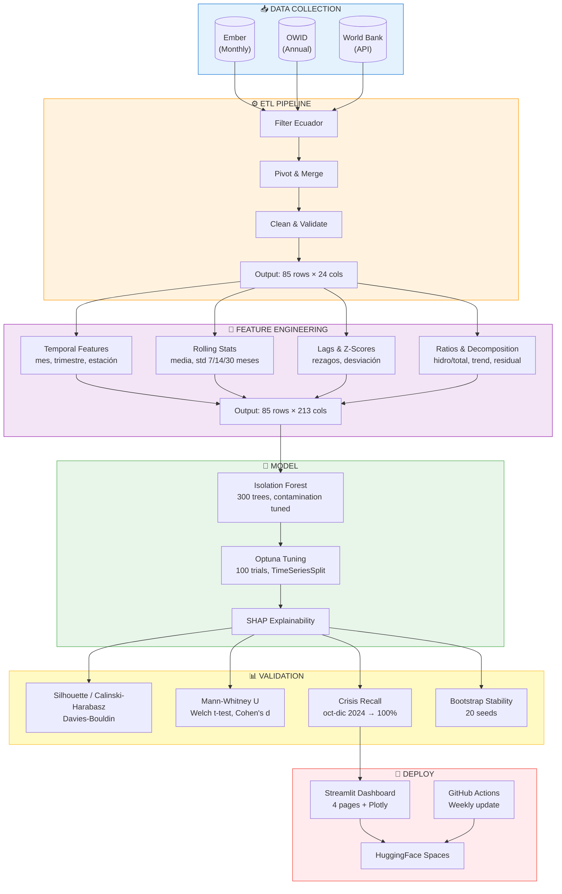

# General Pipeline / Pipeline General

```mermaid
flowchart TB
    subgraph DATA["📥 DATA COLLECTION"]
        E[("Ember\n(Monthly)")]
        O[("OWID\n(Annual)")]
        W[("World Bank\n(API)")]
    end

    subgraph ETL["⚙️ ETL PIPELINE"]
        D1[Filter Ecuador]
        D2[Pivot & Merge]
        D3[Clean & Validate]
        D4["Output: 85 rows × 24 cols"]
    end

    subgraph FE["🧪 FEATURE ENGINEERING"]
        F1[Temporal Features\nmes, trimestre, estación]
        F2[Rolling Stats\nmedia, std 7/14/30 meses]
        F3[Lags & Z-Scores\nrezagos, desviación]
        F4[Ratios & Decomposition\nhidro/total, trend, residual]
        F5["Output: 85 rows × 213 cols"]
    end

    subgraph MODEL["🤖 MODEL"]
        M1[Isolation Forest\n300 trees, contamination tuned]
        M2[Optuna Tuning\n100 trials, TimeSeriesSplit]
        M3[SHAP Explainability]
    end

    subgraph EVAL["📊 VALIDATION"]
        V1[Silhouette / Calinski-Harabasz\nDavies-Bouldin]
        V2[Mann-Whitney U\nWelch t-test, Cohen's d]
        V3[Crisis Recall\noct-dic 2024 → 100%]
        V4[Bootstrap Stability\n20 seeds]
    end

    subgraph DEPLOY["🚀 DEPLOY"]
        S1[Streamlit Dashboard\n4 pages + Plotly]
        HF[HuggingFace Spaces]
        GA[GitHub Actions\nWeekly update]
    end

    E --> D1
    O --> D1
    W --> D1
    D1 --> D2 --> D3 --> D4
    D4 --> F1 & F2 & F3 & F4
    F1 & F2 & F3 & F4 --> F5
    F5 --> M1
    M1 --> M2
    M2 --> M3
    M3 --> V1 & V2 & V3 & V4
    V3 --> S1
    S1 --> HF
    GA --> HF

    style DATA fill:#E3F2FD,stroke:#1976D2
    style ETL fill:#FFF3E0,stroke:#FF9800
    style FE fill:#F3E5F5,stroke:#9C27B0
    style MODEL fill:#E8F5E9,stroke:#4CAF50
    style EVAL fill:#FFF9C4,stroke:#FBC02D
    style DEPLOY fill:#FFEBEE,stroke:#F44336
```