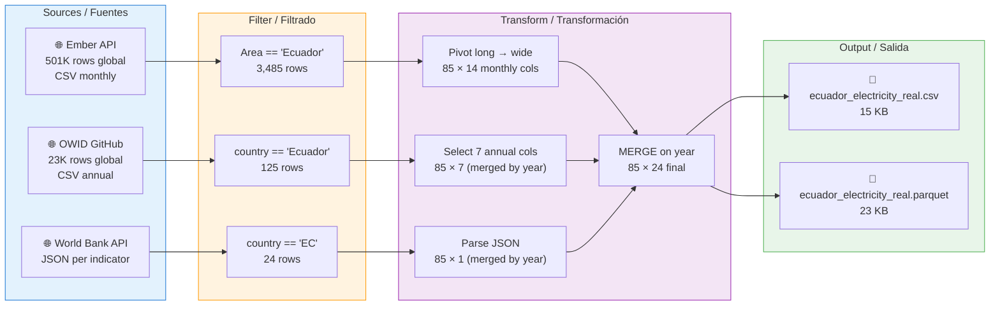

# Data Flow / Flujo de Datos

```mermaid
flowchart LR
    subgraph SOURCES["Sources / Fuentes"]
        E["🌐 Ember API\n501K rows global\nCSV monthly"]
        O["🌐 OWID GitHub\n23K rows global\nCSV annual"]
        W["🌐 World Bank API\nJSON per indicator"]
    end

    subgraph FILTER["Filter / Filtrado"]
        FE["Area == 'Ecuador'\n3,485 rows"]
        FO["country == 'Ecuador'\n125 rows"]
        FW["country == 'EC'\n24 rows"]
    end

    subgraph TRANSFORM["Transform / Transformación"]
        P1["Pivot long → wide\n85 × 14 monthly cols"]
        P2["Select 7 annual cols\n85 × 7 (merged by year)"]
        P3["Parse JSON\n85 × 1 (merged by year)"]
        MG["MERGE on year\n85 × 24 final"]
    end

    subgraph OUTPUT["Output / Salida"]
        CSV["📄 ecuador_electricity_real.csv\n15 KB"]
        PQ["📄 ecuador_electricity_real.parquet\n23 KB"]
    end

    E --> FE --> P1
    O --> FO --> P2
    W --> FW --> P3
    P1 & P2 & P3 --> MG
    MG --> CSV & PQ

    style SOURCES fill:#E3F2FD,stroke:#1976D2
    style FILTER fill:#FFF3E0,stroke:#FF9800
    style TRANSFORM fill:#F3E5F5,stroke:#9C27B0
    style OUTPUT fill:#E8F5E9,stroke:#4CAF50
```