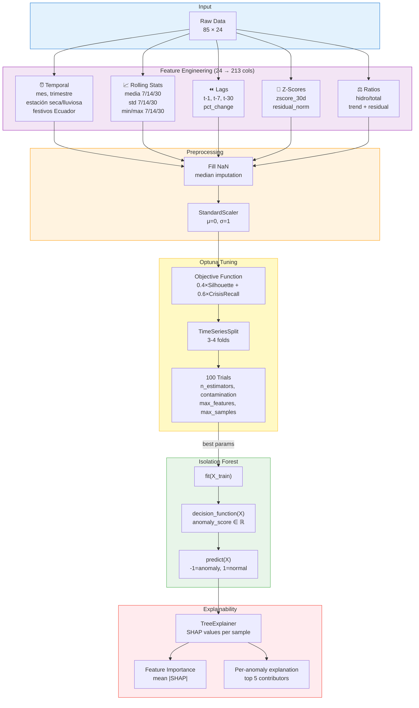

# Model Pipeline / Pipeline del Modelo

```mermaid
flowchart TB
    subgraph INPUT["Input"]
        RAW["Raw Data\n85 × 24"]
    end

    subgraph FE["Feature Engineering (24 → 213 cols)"]
        T["⏰ Temporal\nmes, trimestre\nestación seca/lluviosa\nfestivos Ecuador"]
        R["📈 Rolling Stats\nmedia 7/14/30\nstd 7/14/30\nmin/max 7/14/30"]
        L["⏪ Lags\nt-1, t-7, t-30\npct_change"]
        Z["📐 Z-Scores\nzscore_30d\nresidual_norm"]
        RA["⚖️ Ratios\nhidro/total\ntrend + residual"]
    end

    subgraph SCALE["Preprocessing"]
        SC["StandardScaler\nμ=0, σ=1"]
        NA["Fill NaN\nmedian imputation"]
    end

    subgraph TUNE["Optuna Tuning"]
        OBJ["Objective Function\n0.4×Silhouette + 0.6×CrisisRecall"]
        TS["TimeSeriesSplit\n3-4 folds"]
        TR["100 Trials\nn_estimators, contamination\nmax_features, max_samples"]
    end

    subgraph IF["Isolation Forest"]
        FIT["fit(X_train)"]
        SCORE["decision_function(X)\nanomaly_score ∈ ℝ"]
        PRED["predict(X)\n-1=anomaly, 1=normal"]
    end

    subgraph EXPLAIN["Explainability"]
        SHAP["TreeExplainer\nSHAP values per sample"]
        IMP["Feature Importance\nmean |SHAP|"]
        WHY["Per-anomaly explanation\ntop 5 contributors"]
    end

    RAW --> T & R & L & Z & RA
    T & R & L & Z & RA --> NA --> SC
    SC --> OBJ
    OBJ --> TS --> TR
    TR -->|best params| FIT
    FIT --> SCORE --> PRED
    PRED --> SHAP --> IMP & WHY

    style INPUT fill:#E3F2FD,stroke:#1976D2
    style FE fill:#F3E5F5,stroke:#9C27B0
    style SCALE fill:#FFF3E0,stroke:#FF9800
    style TUNE fill:#FFF9C4,stroke:#FBC02D
    style IF fill:#E8F5E9,stroke:#4CAF50
    style EXPLAIN fill:#FFEBEE,stroke:#F44336
```