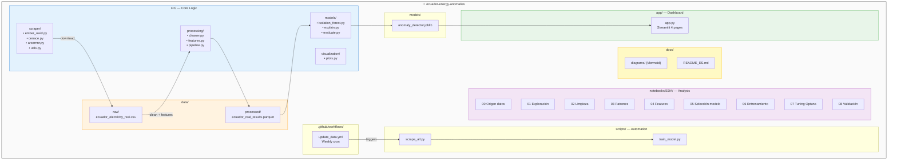

# Project Architecture / Arquitectura del Proyecto

```mermaid
graph TB
    subgraph REPO["📁 ecuador-energy-anomalies"]
        subgraph SRC["src/ — Core Logic"]
            SC["scraper/\n• ember_owid.py\n• cenace.py\n• arcernnr.py\n• utils.py"]
            PR["processing/\n• cleaner.py\n• features.py\n• pipeline.py"]
            MD["models/\n• isolation_forest.py\n• explain.py\n• evaluate.py"]
            VS["visualization/\n• plots.py"]
        end

        subgraph NB["notebooks/EDA/ — Analysis"]
            N0["00 Origen datos"]
            N1["01 Exploración"]
            N2["02 Limpieza"]
            N3["03 Patrones"]
            N4["04 Features"]
            N5["05 Selección modelo"]
            N6["06 Entrenamiento"]
            N7["07 Tuning Optuna"]
            N8["08 Validación"]
        end

        subgraph APP["app/ — Dashboard"]
            ST["app.py\nStreamlit 4 pages"]
        end

        subgraph SCRIPTS["scripts/ — Automation"]
            S1["scrape_all.py"]
            S2["train_model.py"]
        end

        subgraph DATA["data/"]
            RAW["raw/\necuador_electricity_real.csv"]
            PROC["processed/\necuador_real_results.parquet"]
        end

        subgraph MODELS["models/"]
            JOB["anomaly_detector.joblib"]
        end

        subgraph DOCS["docs/"]
            DG["diagrams/ (Mermaid)"]
            RE["README_ES.md"]
        end

        subgraph CI[".github/workflows/"]
            GA["update_data.yml\nWeekly cron"]
        end
    end

    SC -->|download| RAW
    RAW -->|clean + features| PR
    PR --> PROC
    PROC --> MD
    MD --> JOB
    JOB --> ST
    GA -->|triggers| S1
    S1 --> S2

    style REPO fill:#FAFAFA,stroke:#333
    style SRC fill:#E3F2FD,stroke:#1976D2
    style NB fill:#F3E5F5,stroke:#9C27B0
    style APP fill:#E8F5E9,stroke:#4CAF50
    style DATA fill:#FFF3E0,stroke:#FF9800
    style DOCS fill:#FFF9C4,stroke:#FBC02D
```