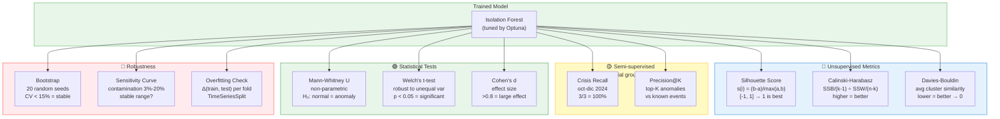

# Validation Framework / Marco de Validación

```mermaid
flowchart TB
    subgraph MODEL["Trained Model"]
        IF["Isolation Forest\n(tuned by Optuna)"]
    end

    subgraph UNSUP["🔵 Unsupervised Metrics\n(no labels needed)"]
        S["Silhouette Score\ns(i) = (b-a)/max(a,b)\n[-1, 1] → 1 is best"]
        CH["Calinski-Harabasz\nSSB/(k-1) ÷ SSW/(n-k)\nhigher = better"]
        DB["Davies-Bouldin\navg cluster similarity\nlower = better → 0"]
    end

    subgraph SEMI["🟡 Semi-supervised\n(partial ground truth)"]
        CR["Crisis Recall\noct-dic 2024\n3/3 = 100%"]
        PK["Precision@K\ntop-K anomalies\nvs known events"]
    end

    subgraph STAT["🟢 Statistical Tests"]
        MW["Mann-Whitney U\nnon-parametric\nH₀: normal = anomaly"]
        WT["Welch's t-test\nrobust to unequal var\np < 0.05 = significant"]
        CD["Cohen's d\neffect size\n>0.8 = large effect"]
    end

    subgraph ROBUST["🔴 Robustness"]
        BS["Bootstrap\n20 random seeds\nCV < 15% = stable"]
        SENS["Sensitivity Curve\ncontamination 3%-20%\nstable range?"]
        OVF["Overfitting Check\nΔ(train, test) per fold\nTimeSeriesSplit"]
    end

    IF --> S & CH & DB
    IF --> CR & PK
    IF --> MW & WT & CD
    IF --> BS & SENS & OVF

    style MODEL fill:#E8F5E9,stroke:#4CAF50
    style UNSUP fill:#E3F2FD,stroke:#1976D2
    style SEMI fill:#FFF9C4,stroke:#FBC02D
    style STAT fill:#E8F5E9,stroke:#388E3C
    style ROBUST fill:#FFEBEE,stroke:#F44336
```