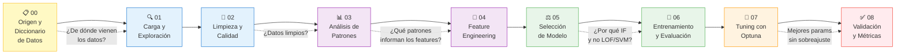

# EDA Workflow / Flujo de Notebooks

```mermaid
flowchart LR
    N0["📋 00\nOrigen y\nDiccionario\nde Datos"]
    N1["🔍 01\nCarga y\nExploración"]
    N2["🧹 02\nLimpieza y\nCalidad"]
    N3["📊 03\nAnálisis de\nPatrones"]
    N4["🧪 04\nFeature\nEngineering"]
    N5["⚖️ 05\nSelección\nde Modelo"]
    N6["🎯 06\nEntrenamiento\ny Evaluación"]
    N7["🔧 07\nTuning con\nOptuna"]
    N8["✅ 08\nValidación\ny Métricas"]

    N0 --> N1 --> N2 --> N3 --> N4 --> N5 --> N6 --> N7 --> N8

    N0 -.->|"¿De dónde vienen\nlos datos?"| N1
    N2 -.->|"¿Datos limpios?"| N3
    N3 -.->|"¿Qué patrones\ninforman los features?"| N4
    N5 -.->|"¿Por qué IF\ny no LOF/SVM?"| N6
    N7 -.->|"Mejores params\nsin sobreajuste"| N8

    style N0 fill:#FFF9C4,stroke:#FBC02D
    style N1 fill:#E3F2FD,stroke:#1976D2
    style N2 fill:#E3F2FD,stroke:#1976D2
    style N3 fill:#F3E5F5,stroke:#9C27B0
    style N4 fill:#F3E5F5,stroke:#9C27B0
    style N5 fill:#E8F5E9,stroke:#4CAF50
    style N6 fill:#E8F5E9,stroke:#4CAF50
    style N7 fill:#FFF3E0,stroke:#FF9800
    style N8 fill:#FFEBEE,stroke:#F44336
```